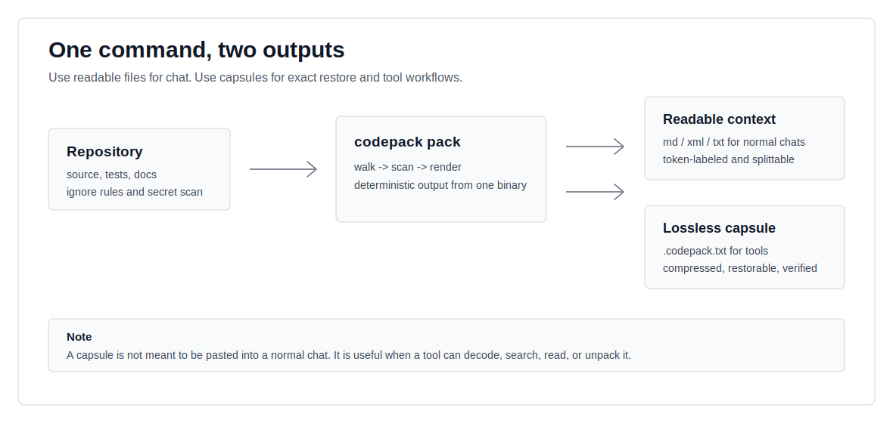
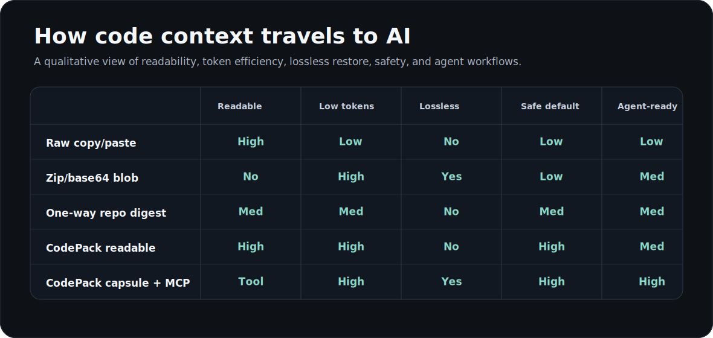
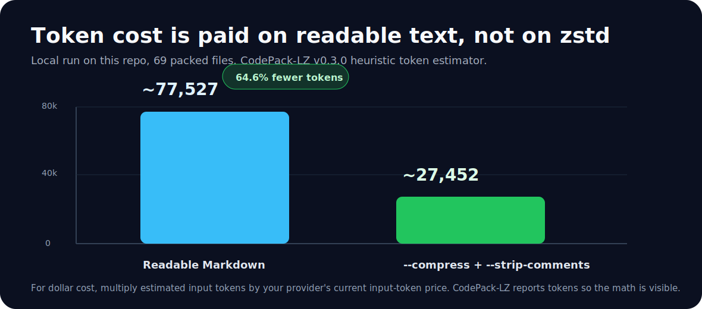
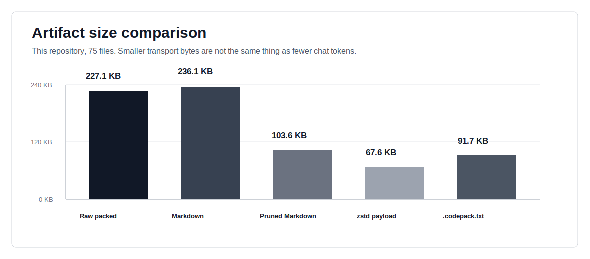

# CodePack-LZ

**A dependency-light codebase packer for AI context: readable Markdown for
normal chats, plus a lossless `.codepack.txt` capsule for tools and agents.**

CodePack-LZ is for the awkward middle ground between "paste a few files" and
"give an AI the whole repository somehow". It gives you two outputs, each honest
about what it can do:

```bash
codepack pack . --format md --redact -o repo.md
codepack pack . --format md --compress --strip-comments --redact --split-output -o repo.md
codepack pack . --format codepack --codec zstd -o repo.codepack.txt
codepack unpack repo.codepack.txt --dry-run
```

<p align="center">
  
</p>

## The core idea

Most code-to-AI workflows mix up two separate jobs:

1. **LLM reading**: the model needs plain text it can attend to.
2. **Repository transport**: tools need an exact, compact, verifiable snapshot.

CodePack-LZ keeps those jobs separate. `md`, `xml`, and `txt` are for Gemini,
ChatGPT, Claude, and other normal chat surfaces. `codepack` is for restore,
archive, CI, and tool-aware agents through the CLI or MCP. A compressed
base64 capsule is not magic LLM food; it becomes useful when a decoder can
search, list, read, or unpack it.

## When should I use which output?

| Need | Use | Why |
|---|---|---|
| Paste code into Gemini/ChatGPT/Claude | `--format md --redact` | human and model readable |
| Fit a large repo into fewer input tokens | `--format md --compress --strip-comments --split-output` | removes low-signal code before rendering |
| Move an exact repo snapshot through text-only channels | `--format codepack --codec zstd` | compact, lossless, hash-verified |
| Verify an artifact without restoring it | `codepack stats` / `codepack unpack --dry-run` | inspect header and prove hashes |
| Let an agent request files on demand | `codepack mcp` | exposes pack/stat tools over stdio MCP |
| Gate CI on accidental secrets | default `pack` behavior | secret scan is on unless disabled |

## Why this exists

<p align="center">
  
</p>

Raw paste is readable but messy and expensive. Zip/base64 is compact but opaque
to normal LLM chats. One-way repo digests are useful, but you cannot restore
the exact tree from them. CodePack-LZ gives you the readable artifact when the
receiver is a chat model and the capsule artifact when the receiver is a tool.

Compared with heavier ecosystem-specific workflows, this project optimizes for:

- **one static Go binary**: no Node runtime, no Python runtime, no CGO
- **honest token accounting**: local estimates by default, Anthropic exact
  count-tokens mode when you opt in
- **secret safety by default**: scan first, fail with exit code `3`, or redact
  explicitly
- **lossless round trip**: `.codepack.txt` restores the tree and verifies every
  stored SHA-256
- **agent compatibility**: stdio MCP server for tool-aware environments

## Token and size benchmarks

These are from this repository, measured with CodePack-LZ v0.3.0 on a local
smoke run. They are not universal performance claims; they show the budget
shape and are reproducible in [docs/benchmarks.md](docs/benchmarks.md).

<p align="center">
  
</p>

<p align="center">
  
</p>

| Output | Artifact bytes | Estimated input tokens | What it means |
|---|---:|---:|---|
| Readable Markdown | `213,244` | `~77,527` | direct chat context |
| Pruned readable Markdown | `82,531` | `~27,452` | direct chat context, fewer tokens |
| zstd payload inside capsule | `62,099` | not LLM-readable | transport bytes only |
| `.codepack.txt` capsule | `84,283` | not LLM-readable | base64 text wrapper, restorable |

Token cost formula:

```text
input cost = readable input tokens * your provider's current input-token price
```

gzip/zstd saves bytes, not chat tokens. Token reduction comes from readable
rendering choices such as `--strip-comments`, `--compress`, `--include`, and
`--exclude`.

## Install

```bash
go install github.com/evan-william/codepack-lz/cmd/codepack@latest
```

Or build a static binary anywhere Go runs:

```bash
CGO_ENABLED=0 go build -o codepack ./cmd/codepack
```

## Quick start

Readable context for a normal chat:

```bash
codepack pack . --format md --redact -o repo.md
```

Split readable context into multiple paste/upload parts:

```bash
codepack pack . \
  --format md \
  --compress \
  --strip-comments \
  --redact \
  --split-output \
  --split-size 200KiB \
  -o repo.md
```

Lossless capsule for restore or tool-aware agents:

```bash
codepack pack . --format codepack --codec zstd --redact -o repo.codepack.txt
codepack stats repo.codepack.txt
codepack unpack repo.codepack.txt --dry-run
```

Encrypted capsule:

```bash
export CODEPACK_KEY_HEX=$(openssl rand -hex 32)
codepack pack . --format codepack --codec zstd --encrypt -o repo.enc.codepack.txt
codepack unpack repo.enc.codepack.txt --out restored
```

Exact Anthropic token counts:

```bash
ANTHROPIC_API_KEY=... ANTHROPIC_MODEL=your-model codepack pack . \
  --count-tokens api \
  -o repo.md
```

## CLI

```bash
codepack pack [path] [flags]
codepack unpack <file.codepack.txt> [--out DIR] [--dry-run]
codepack stats <file>
codepack mcp
codepack version
```

Common `pack` flags:

| Flag | Default | Notes |
|---|---|---|
| `--format` | `md` | `md`, `xml`, `txt`, `codepack` |
| `-o, --output` | stdout | summary always goes to stderr |
| `--include` / `--exclude` | none | repeatable glob filters |
| `--no-default-ignore` | off | disable built-in noise rules |
| `--max-file-size` | `1MiB` | accepts `512KiB`, `2MB`, or raw bytes |
| `--strip-comments` | off | readable formats only |
| `--compress` | off | readable formats only; structural pruning heuristic |
| `--count-tokens` | `est` | `est`, `off`, or `api` |
| `--codec` | `gzip` | envelope only: `gzip` or `zstd` |
| `--split-output` | off | readable formats only; writes `.part001` files |
| `--split-size` | `1MiB` | maximum bytes per split part |
| `--encrypt` | off | envelope only; AES-256-GCM |
| `--key-env` | `CODEPACK_KEY_HEX` | env var holding a 32-byte hex key |
| `--redact` | off | mask detected secrets as `[REDACTED:<rule>]` |
| `--no-secret-scan` | off | dangerous; disables secret scanning |
| `--copy` | off | best-effort clipboard copy |

`.codepackignore` uses a documented gitignore-like subset: comments, trailing
`/` for directories, `!` negation, and last-match-wins behavior.

## Security model

- Secret scanning is on by default and returns exit code `3` when findings are
  not redacted.
- Findings print as `path:line rule (preview...)`, not the full secret.
- Use `--redact` to produce a shareable artifact with detected secrets masked.
- Use `codepack:allow` on a line for intentional test fixtures.
- Base64 is encoding, not encryption. Use `--encrypt` when the capsule should
  be opaque to anyone without `CODEPACK_KEY_HEX`.
- `unpack` rejects path traversal, never overwrites existing files, and
  verifies every restored file hash.

More detail: [docs/security.md](docs/security.md).

CI gate example:

```yaml
- run: codepack pack . --format md -o /dev/null
```

## MCP

`codepack mcp` runs a small stdio Model Context Protocol server. In v0.3.0 it
exposes:

| Tool | Purpose |
|---|---|
| `pack_codebase` | pack a local directory into `md`, `xml`, `txt`, or `codepack` |
| `stats_codepack` | inspect a CodePack artifact header |

This is the path toward the original "binary-ish but AI-readable" idea: the AI
does not stare at compressed base64; it calls tools that decode and surface the
right files or stats.

## Format stability

The envelope format is versioned and specified in
[docs/format-spec.md](docs/format-spec.md). A capsule contains a plaintext
header, then base64 payload markers. The payload is deterministic NDJSON
compressed with gzip or zstd and optionally encrypted with AES-256-GCM.

## Project status

Current prototype: **v0.3.0**.

Implemented:

- readable outputs: `md`, `xml`, `txt`
- lossless envelope: `codepack`
- gzip and zstd codecs
- `pack -> unpack` hash verification
- split readable output
- heuristic token estimates and Anthropic exact count-token mode
- default secret scanning and redaction
- structural readable compression
- optional AES-256-GCM envelope encryption
- stdio MCP server
- prototype VS Code extension

Future work:

- richer MCP tools such as `list_files`, `read_file`, and `search`
- language-aware pruning backends
- signed release artifacts
- packaged VS Code Marketplace distribution

## VS Code

`vscode-extension/` contains a prototype command:
**CodePack-LZ: Pack Workspace to Clipboard**. It shells out to the `codepack`
binary on your `PATH`.

## License

MIT. Secret-detection rules are adapted from
[gitleaks](https://github.com/gitleaks/gitleaks) under the MIT license.
